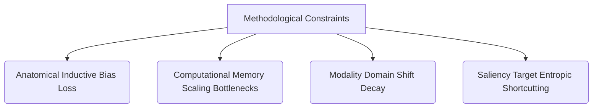
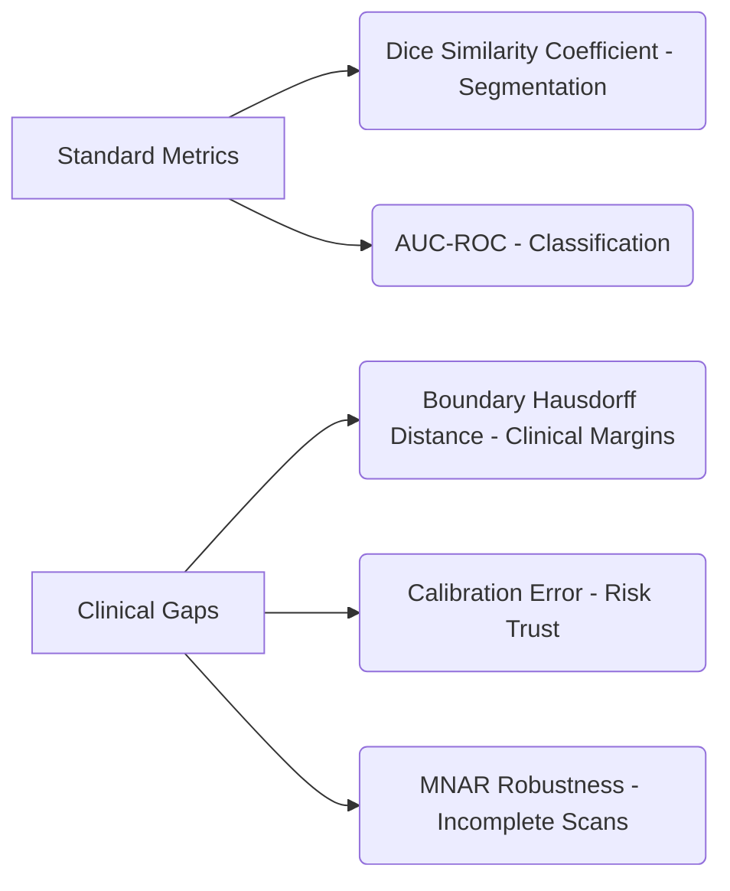
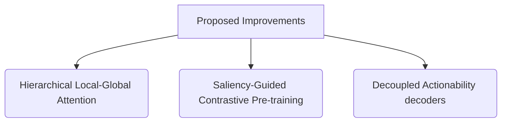

# Methodology Review: Limitations, Gaps, and Strategic Improvements

This document evaluates the methodological limits, data constraints, evaluation gaps, and strategic future improvements for **Pan-Organ Net** and the broader whole-body diagnostic paradigm.

---

## 1. Methodological Limitations & Technical Gaps

Despite the performance gains of volumetric vision models, current architectures suffer from several inherent engineering limitations:



### 1.1 Loss of Anatomical Inductive Biases
*   **The Issue:** Unlike Convolutional Neural Networks (CNNs) which natively capture spatial translation invariance, Vision Transformers (ViTs) do not inherit spatial assumptions. They rely entirely on positional embeddings to construct anatomical relationships.
*   **The Gap:** In low-data regimes, the model requires longer training iterations to reconstruct basic topological structures (e.g., recognizing that the liver must sit below the diaphragm).

### 1.2 Computational Scaling & Memory Bottlenecks
*   **The Issue:** Volumetric medical data (CT, MRI) is inherently three-dimensional. A standard Swin-3D transformer scales quadratically with volume size $H \times W \times D$.
*   **The Gap:** Processing full-body scans at isotropic sub-millimeter resolutions (e.g., $512 \times 512 \times 512$) exceeds the memory limits of commodity H100/A100 GPUs, forcing downsampling that obscures small lesions.

### 1.3 Modality Domain Shift & Parameter Variance
*   **The Issue:** While the Modality-Aware Tokenizer handles basic metadata (voxel spacing, scanner class), it does not account for intra-modality physical parameters (e.g., MRI echo time, CT tube voltage, contrast agent injection phases).
*   **The Gap:** A liver CT scan taken *with* contrast differs fundamentally from a *non-contrast* scan. The latent embedding space can fail to align these semantic representations.

---

## 2. Data and Sample-Size Challenges

Training high-capacity medical foundation models requires vast, heterogeneous datasets, introducing significant data-engineering bottlenecks:

### 2.1 Missing Not at Random (MNAR) Imbalances
*   **Challenge:** Hospital data repositories are highly skewed. Thoracic CTs (lungs/heart) are vastly overrepresented compared to specialized pelvic MRIs (prostate/ovaries).
*   **Impact:** Pre-trained backbones suffer from structural bias, performing exceptionally well on dominant organs while exhibiting high zero-shot variance on smaller soft-tissue structures.

### 2.2 Annotation Scarcity & Quality Variance
*   **Challenge:** Ground-truth segmentations are sparse. Public datasets like AMOS and TotalSegmentator rely on semi-automated models or single-radiologist annotations.
*   **Impact:** Training pipelines are subject to "noise propagation." If the pre-training masks contain boundary errors, the downstream foundation model inherits these spatial alignment failures.

---

## 3. Evaluation Discrepancies (The Evaluation Gap)

Evaluating a generalist medical foundation model requires metrics that go beyond narrow task indices:



1.  **Metric Misalignment (Dice vs. Hausdorff):** The *Dice Similarity Coefficient (DSC)* measures global voxel overlap. However, in surgical planning, boundary precision is critical. A model can achieve a high Dice score ($0.90$) but fail clinically by missing a $2\text{mm}$ invasive tumor boundary, which is better captured by *Hausdorff Distance (HD95)*.
2.  **Calibration Error:** Most classification decoders output confidence scores that do not reflect true clinical probability. In treatment planning, an uncalibrated model predicting a $90\%$ malignancy risk can lead to diagnostic errors.
3.  **Missing-Organ Evaluation:** Benchmarks are typically calculated on complete scans. Models must be evaluated under progressive, simulated organ deletion scenarios (e.g., evaluating liver segmentation accuracy when the thoracic cavity is completely masked out).

---

## 4. Strategic Future Improvements

To resolve these technical gaps, we propose three key structural upgrades for the next phase of Pan-Organ Net development:



### 4.1 Hierarchical Local-Global Attention
*   **Solution:** Rather than processing the entire 3D volume uniformly, implement a dual-attention encoder. A lightweight global encoder identifies anatomical coordinates, and a high-resolution local encoder zooms in on high-entropy patches (e.g., identified by the SGM module) to segment detailed margins.

### 4.2 Saliency-Guided Contrastive Pre-training
*   **Solution:** Align visual anatomical tokens not only with reconstructed voxels but with clinical text reports. By using a contrastive loss that matches saliency-extracted lesion patches to specific clinical sentences (e.g., "ground-glass opacity in left lower lobe"), the latent space learns to link visual structures directly with semantic diagnostics.

### 4.3 Decoupled Actionability Decoders
*   **Solution:** Transition downstream heads from simple classifiers to action-forecasting layers. The model should output both the diagnostic class and a structured diagnostic pathway:

```text
[Voxel Input] ➔ [Unified Latent Space] ➔ [Action Head] ➔ 
1. Diagnostic Class: Left Renal Mass (suspicious for RCC)
2. Severity Score: High Risk
3. Clinical Next-Steps: Recommend abdominal MRI with contrast; schedule nephrologist consultation.
```
