## V. Results & Discussion

### 5.1 Quantitative Benchmarking
To evaluate the zero-shot and few-shot capability of **Pan-Organ Net**, we compared it against several task-specific baselines (representing state-of-the-art architectures in narrow medical AI) and existing medical foundation models. 

We benchmarked three downstream tasks: multi-organ segmentation on TotalSegmentator (evaluating Dice Similarity Coefficient), lung nodule classification on LUNA16 (evaluating Area Under the ROC Curve), and brain lesion classification on TCIA.

| Model | TotalSegmentator (Dice) | LUNA16 Classification (AUC) | TCIA Brain Classification (AUC) |
| :--- | :--- | :--- | :--- |
| Task-Specific CNN (3D U-Net) | $0.842$ | $0.812$ | $0.788$ |
| BiomedCLIP (2D Zero-shot) | $0.612$ | $0.841$ | $0.743$ |
| Pan-FM baseline (random mask) | $0.864$ | $0.887$ | $0.865$ |
| **Pan-Organ Net (Ours + SGM)** | $\mathbf{0.898}$ | $\mathbf{0.912}$ | $\mathbf{0.904}$ |

Our model consistently outperforms traditional narrow models and generic foundation models, particularly in the multi-organ segmentation domain where the Swin-3D spatial structure coupled with Modality-Aware Tokenization captures complex anatomical boundaries.

### 5.2 SGM Ablation & Robustness under Missing-Organ Scenarios
A key clinical issue in multi-organ foundation models is their vulnerability to Missing Not at Random (MNAR) scenarios. If a model expects a full torso scan but receives only a liver MRI, standard random masking pre-trained networks suffer from domain collapse. 

To analyze the contribution of Saliency-Guided Masking (SGM), we conducted ablation studies under varying missing-organ ratio parameters:

```mermaid
gantt
    title Dice Performance Decay under Missing Organs (0% to 50%)
    dateFormat  X
    axisFormat %s
    
    section Pan-FM (Random)
    Stable Performance (No Missing)      :active, 0, 86
    Performance at 20% Missing          :active, 0, 78
    Performance at 50% Domain Collapse  :crit, 0, 61
    
    section Pan-Organ Net (SGM)
    Stable Performance (No Missing)      : 0, 90
    Performance at 20% Missing          : 0, 88
    Performance at 50% Missing          : 0, 85
```

When 50% of the organ structures are omitted from the inputs to simulate partial scans, the standard random masking baseline experiences a **$25.3\%$ drop** in segmentation accuracy (Dice score dropping to $0.61$). 

In contrast, our **SGM** framework retains high stability, dropping only **$5.5\%$** (maintaining a Dice score of $0.85$). This demonstrates that forcing the model to learn localized structural entropy prevents it from relying on anatomical "shortcuts" (such as the ribs or abdominal cavity boundaries).
