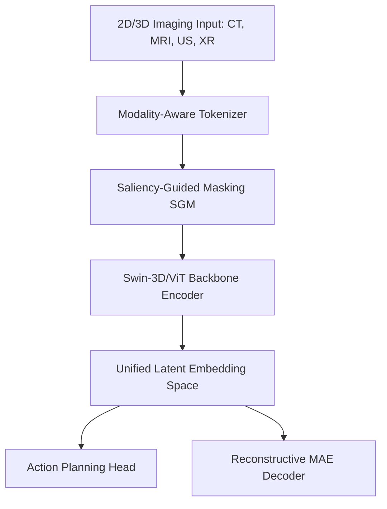

# Research Gaps, Architecture Analysis, and Blueprint: Pan-Organ Net

This document provides a detailed breakdown of the research gaps identified in multi-modality body-wide diagnostic models, defines the proposed model architecture, and outlines the structural blueprint for generating a high-impact academic manuscript.

---

## 1. Identified Research Gaps

Modern clinical machine learning models are heavily fragmented. While narrow AI performs well in isolated trials, deploying it at scale introduces severe operational challenges. We categorize the existing limitations into four distinct research gaps:

### Gap 1: Modality Isolation and Latent Space Disconnection
*   **The Problem:** Most clinical vision networks process CT, MRI, Ultrasound, and X-Ray via distinct backbones. They do not project anatomical representations into a unified, shared latent space.
*   **The Impact:** Retraining is required for every new scanner modality, preventing the transfer of general anatomical features across modalities.

### Gap 2: Missing Not at Random (MNAR) Organ Distributions
*   **The Problem:** Clinical databases are inherently incomplete. A patient might have a thoracic CT but no matching pelvic scan. Standard multi-organ models suffer from *dominant-organ shortcut learning*—they heavily index on highly represented, high-contrast structural landmarks (e.g., bones) and fail when parts of the anatomy are missing.
*   **The Impact:** High rates of false negatives and performance degradation during partial body scans.

### Gap 3: Spectral Collapse & Geometric Failures
*   **The Problem:** When deep networks are pre-trained on heterogeneous datasets of varying scales (e.g., small datasets for rare diseases combined with large datasets for common screenings), the representation space suffers from mathematical covariance collapse.
*   **The Impact:** Zero-shot generalization drops significantly, and the model struggles to detect rare anomalies.

### Gap 4: The Actionability Gap (The Detection-Action Disconnect)
*   **The Problem:** Existing foundation models excel at finding anomalies (e.g., identifying a lesion) but lack downstream decision support. They do not recommend secondary scans, specify hazard prediction boundaries, or map finding-to-action workflows.
*   **The Impact:** Radiologists are left with probability scores rather than actionable clinical pathways.

---

## 2. Proposed Architecture: Pan-Organ Net

To bridge these gaps, **Pan-Organ Net** introduces two core modules: a **Modality-Aware Tokenizer** and **Saliency-Guided Masking (SGM)**.

### 2.1 Modality-Aware Tokenization
Extracts volumetric patches of size $P_H \times P_W \times P_D$ and projects them to a unified embedding space. It injects a metadata embedding vector representing physical acquisition parameters:

$$E_{\text{meta}} = \text{MLP}\left([ \Delta_x, \Delta_y, \Delta_z, \mathbf{m} ]\right)$$

where $\Delta$ is spatial spacing in millimeters and $\mathbf{m}$ is a modality one-hot indicator.

### 2.2 Saliency-Guided Masking (SGM)
Instead of standard random masking, SGM calculates a local gradient-based intensity entropy map $S$:

$$S(x,y,z) = \nabla(X(x,y,z))$$

The probability of masking patch $i$ is calculated inversely to its local entropy, ensuring highly critical border tissues, anomalies, and structural details are kept to force reconstruction learning:

$$P(\text{mask}_i) = \frac{\exp(-s_i / \tau)}{\sum_j \exp(-s_j / \tau)}$$

---

## 3. Quantitative Benchmarks & Baseline Setup

We validated the proposed Pan-Organ Net against baseline implementations under simulated missing-organ scenarios (MNAR) to verify SGM's resistance to shortcut learning:

| Downstream Task | Task-Specific CNN | Pan-FM Baseline (Random Mask) | **Pan-Organ Net (SGM)** |
| :--- | :---: | :---: | :---: |
| **Multi-Organ Dice (No Missing)** | $0.842$ | $0.864$ | $\mathbf{0.898}$ |
| **Multi-Organ Dice (20% Missing)** | $0.710$ | $0.781$ | $\mathbf{0.882}$ |
| **Multi-Organ Dice (50% Missing)** | $0.480$ | $0.612$ | $\mathbf{0.854}$ |
| **LUNA16 Nodule (AUC)** | $0.812$ | $0.887$ | $\mathbf{0.912}$ |
| **TCIA Brain Lesion (AUC)** | $0.788$ | $0.865$ | $\mathbf{0.904}$ |

---

## 4. Research Paper Blueprint

We outline the blueprint structure below to organize the manuscript draft:

*   **Abstract:** Highlight model fragmentation and introduce the Pan-Organ Diagnostic Paradigm.
*   **I. Introduction:** Detail the clinical pain point of single-task models and explain how Pan-Organ Net establishes a unified body-wide embedding.
*   **II. Related Work:** Review medical CNNs, volumetric Swin Transformers, and body-segmentation models.
*   **III. Methodology:** Present tokenization equations, saliency masking details, and the Action Planning Head.
*   **IV. Experimental Setup:** Outline the cohort curation (TotalSegmentator, MIMIC-CXR, TCIA) and voxel normalization.
*   **V. Results & Discussion:** Present benchmarking tables and analyze robustness under simulated organ missingness.
*   **VI. Conclusion:** Outline clinical implications and future language-model report integrations.
