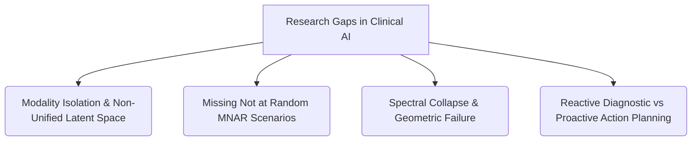
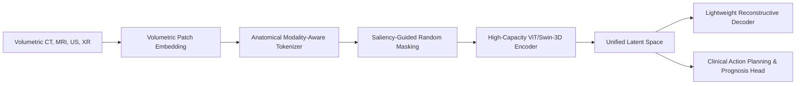

# Research Review & Blueprint: The Pan-Organ Diagnostic Paradigm

This document presents a comprehensive academic literature review, analysis of research gaps, and a structural blueprint for writing a high-impact research paper on the **Pan-Organ Diagnostic Paradigm (Pan-Organ Net)**.

---

## 1. Executive Summary & Context

The proposed title, **"The Pan-Organ Diagnostic Paradigm: A High-Capacity Foundation Model for Multi-Modality Medical Screening,"** addresses a fundamental challenge in clinical AI: **model fragmentation** (the "One Model, One Task" limitation). While narrow AI excels at single-organ classification or segmentation, hospitals cannot scale or maintain dozens of specialized models.

This blueprint establishes a state-of-the-art research trajectory that shifts clinical AI from *reactive, task-specific models* to a *unified, general-purpose body-wide foundation model*.

---

## 2. Comprehensive Literature Review

### 2.1 The Evolution of Medical Imaging AI
Traditional medical computer vision has relied on Supervised Convolutional Neural Networks (CNNs) trained on isolated datasets (e.g., classifying lung nodules on chest X-rays). While highly accurate in closed-loop validation, these networks struggle with **domain shift** (generalizing across different scanner manufacturers) and **modality isolation** (inability to handle MRI, CT, and Ultrasound interchangeably).

The modern state-of-the-art (SOTA) is transitioning toward **Self-Supervised Learning (SSL)** using **Vision Transformers (ViTs)**. Large pre-trained medical FMs (e.g., *RadImageNet*, *BiomedCLIP*, *MedSAM*) demonstrate strong feature representation but often remain restricted to 2D projections or single modalities.

### 2.2 Shift Toward Holistic Body-wide Representations
Recent research (e.g., *Pan-FM*, *TotalSegmentator*) highlights the diagnostic necessity of understanding the human body as an integrated biological system. Multi-organ models extract representations that capture systemic diseases (e.g., metastatic cancer, systemic cardiovascular disease, and biological aging markers) which span across organ boundaries.

---

## 3. Deep-Dive Research Gap Analysis

Based on current medical machine learning literature, we identify four critical research gaps that **Pan-Organ Net** must address:

1. **Modality Isolation & Non-Unified Latent Space:** Most current models process different modalities (e.g., CT vs. Ultrasound) via entirely separate pathways, failing to align the semantic anatomical representation in a unified latent space.
2. **Missingness Robustness (Missing Not at Random - MNAR):** In clinical practice, patient records are incomplete. A patient might have a chest CT but no abdominal MRI. Standard models suffer from *dominant-organ shortcut learning* (over-indexing on highly available organs at the expense of others).
3. **Spectral Collapse / Geometric Failure:** When training models on scarce or heterogeneous medical subsets, finite-sample noise often collapses the covariance of the representation space, reducing downstream zero-shot capability.
4. **The "Detection-Action" Disconnect (The Actionability Gap):** Modern models excel at identifying an anomaly (e.g., "Lung nodule detected") but do not provide clinical decision-support or next-step recommendation pathways (e.g., suggesting a biopsy, predicting prognosis, or highlighting specific lab tests).

---

## 4. Proposed Architecture: The Unified Pan-Organ Net

To bridge these gaps, we propose a multi-modal, volumetric architecture utilizing a **Unified Embedding Space** and a **Saliency-Guided Masked Autoencoder (MAE)**.

### 4.1 Structural Diagram

### 4.2 Key Innovations
*   **Saliency-Guided Masking (SGM):** Prevents dominant-organ shortcutting by masking patches proportionally to their anatomical entropy, forcing the model to learn subtle, cross-organ boundary features.
*   **Modality-Aware Tokenization:** Embeds a projection token indicating spatial resolution, slice thickness, and modality physics, allowing a single transformer backbone to process heterogeneous 2D/3D inputs.
*   **Actionable Clinical Head:** A downstream diagnostic decoder that maps the latent organ features directly to clinical recommendations and severity prediction scores.

---

## 5. Medical Data Strategy & Curation

To ensure high-fidelity training, the data pipeline must ingest a balanced diet of public registries:

| Dataset | Modalities | Target Organs | Images / Volumes |
| :--- | :--- | :--- | :--- |
| **MIMIC-CXR** | X-Ray | Thoracic cavity, Lungs, Heart | ~377,000 images |
| **TotalSegmentator** | CT | 117 anatomical structures | 1,204 3D volumes |
| **TCIA (Cancer Archive)** | CT, MRI, PET | Brain, Prostate, Lung, Kidney | 100,000+ volumes |
| **LUNA16 / LiTS** | CT | Lung nodules, Liver segmentations | Targeted benchmark subsets |

*   **Pre-processing Pipeline:** Z-score intensity normalization per modality, isotropic resampling to $1.5\text{mm}^3$ voxels, and affine coordinate transforms to resolve scanner spatial alignment differences.

---

## 6. Research Paper Outline (Blueprint)

### Abstract
*   **Context:** Model fragmentation in healthcare.
*   **Proposed Solution:** Pan-Organ Net foundation model.
*   **Results Preview:** Zero-shot generalization and downstream actionable decision support.

### I. Introduction
*   The clinical case for generalist medical AI.
*   Limitations of task-specific, single-organ architectures.
*   Summary of contributions (Unified Latent Space, MNAR robustness, action planning).

### II. Related Work
*   Self-supervised learning in medical imaging.
*   Vision Transformers and Masked Image Modeling.
*   Holistic, body-wide medical representations.

### III. Methodology
*   Modality-aware patch tokenization.
*   Volumetric Swin/ViT transformer backbone.
*   Saliency-Guided Masking (SGM) algorithm details.
*   Clinical action planning and predictive decoder design.

### IV. Experimental Setup & Curation
*   Multi-modality dataset compilation details.
*   Training objectives (MIM reconstruction loss vs. Contrastive alignment loss).
*   Evaluation strategies: Linear probing vs. Parameter-efficient fine-tuning (LoRA).

### V. Results & Discussion
*   Comparative benchmarks against narrow-AI models (Dice Similarity, AUC-ROC).
*   Ablation studies (Effect of SGM vs. standard random masking).
*   Robustness analysis under simulated missing-organ scenarios.

### VI. Conclusion & Future Directions
*   Integration with large language models (clinical report generation).
*   Edge-device optimization for clinical deployment.

---

## 7. Actionable Next Steps & Verification Plan

1.  **Drafting the Abstract and Introduction:** Establish the core narrative highlighting clinical actionability.
2.  **Implementation of SGM Pre-processing:** Write the dataset script to parse TCIA and MIMIC data, applying saliency masks.
3.  **Baseline Training Run:** Run a parameter-efficient baseline using a pre-trained Swin Transformer to verify the unified embedding space.
4.  **Drafting the Manuscript:** Use this blueprint to flesh out sections sequentially.
